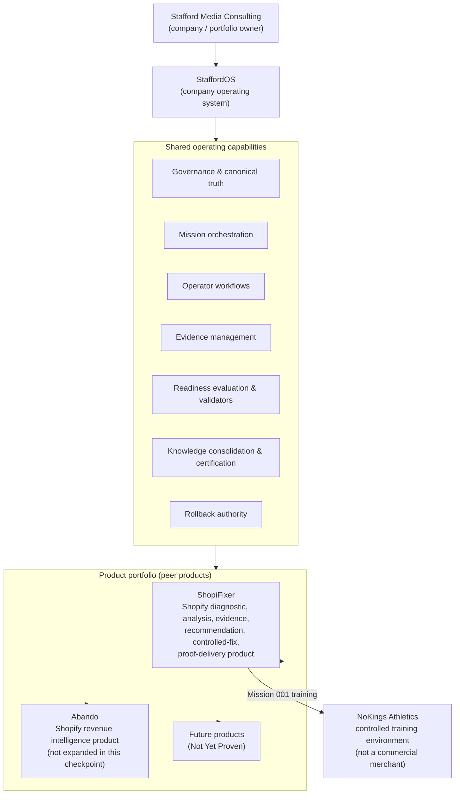
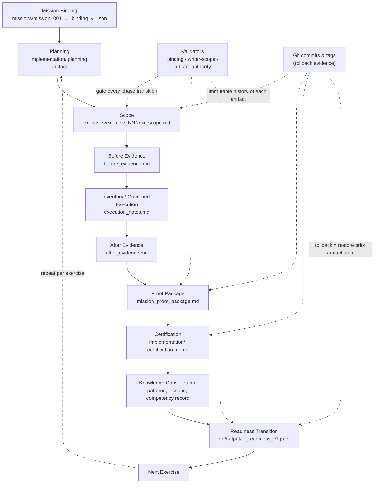
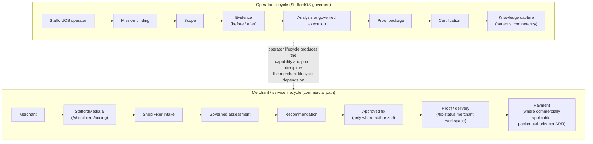
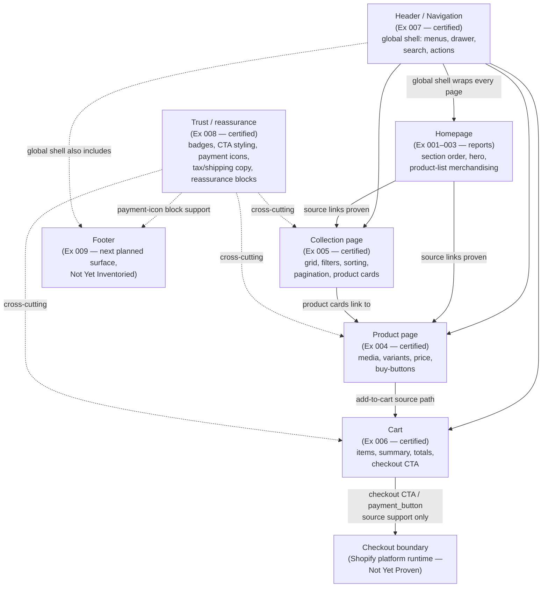
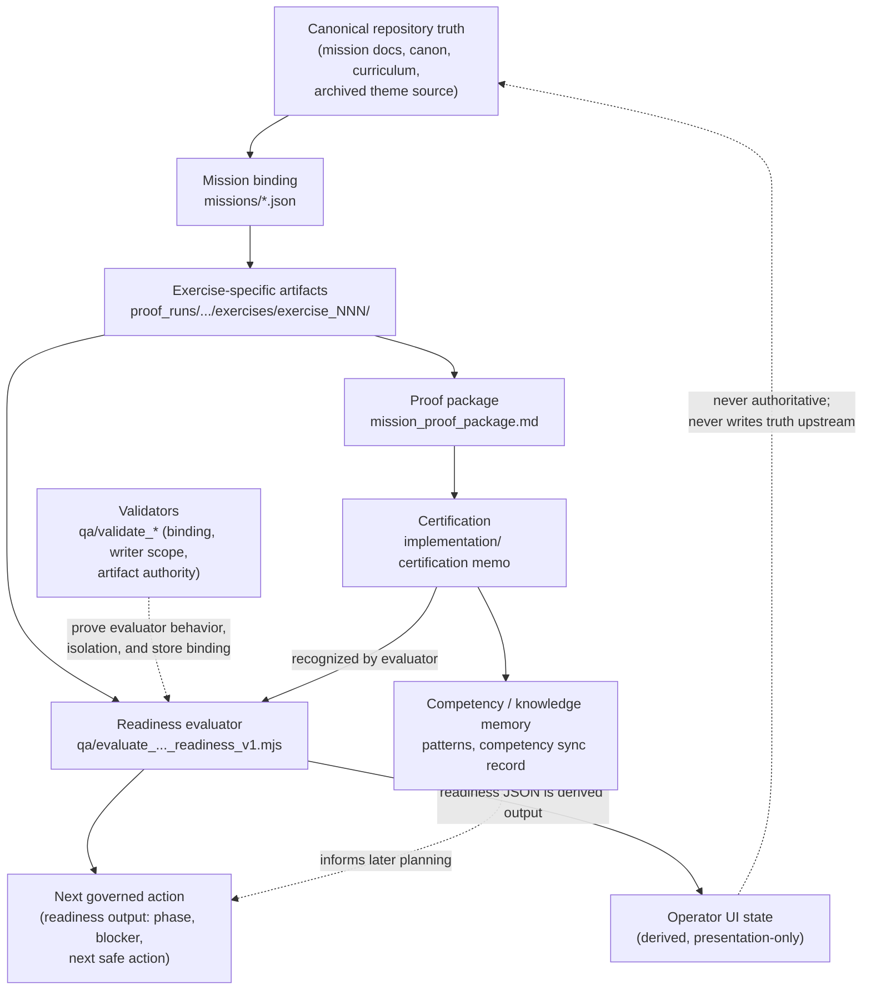

# P11.29 Mission 001 Architecture And Lifecycle Checkpoint

Status:
Complete

Document Type:
Read-only architecture consolidation

Mission Context:
Mission 001 - NoKings Shopify Engineering Training

Authority Mode:
documentation-only

Payment Required:
false

Repository Changes:
This document only. No code, JSON, readiness, validator, or Shopify change.

## Precondition Verification

Verified before this checkpoint was created:

- Exercise 008 certification exists: `staffordos/implementation/p11_28_mission_001_exercise_008_certification_v1.md`
- Readiness reports: `CONDITIONAL_GO` | phase `exercise_009_planning` | blocker `Exercise 009 Planning Missing` | next `Plan Exercise 009 - Footer Inventory` | payment not required | completion not permitted
- Exercises 004 through 008 each hold a `CONDITIONAL GO` certification decision:
  - `staffordos/implementation/p10_9_mission_001_exercise_004_certification_v1.md`
  - `staffordos/implementation/p11_7_mission_001_exercise_005_certification_v1.md`
  - `staffordos/implementation/p11_14_mission_001_exercise_006_certification_v1.md`
  - `staffordos/implementation/p11_21_mission_001_exercise_007_certification_v1.md`
  - `staffordos/implementation/p11_28_mission_001_exercise_008_certification_v1.md`

---

# 1. Executive Perspective

**Stafford Media Consulting** is building a product company operated through a governed operating system. The company owns a portfolio of Shopify-facing products and runs every meaningful unit of work — training, merchant delivery, internal improvement — as a governed, evidence-backed mission.

**StaffordOS** is the company operating system. It is not a product sold to merchants; it is the governance, orchestration, and truth layer the company itself runs on. Repository truth defines it through the mission engine (`STAFFORDOS_MISSION_ENGINE_ARCHITECTURE_V1.md`, where a Mission is the canonical top-level business object), the architecture decision record (`STAFFORDOS_ARCHITECTURE_DECISION_RECORD_V1.md`, which fixes canonical operator and merchant entry points and payment authority), the readiness evaluator and validators under `staffordos/qa/`, the evidence chains under `staffordos/proof_runs/`, and the certification memos under `staffordos/implementation/`.

**ShopiFixer** is a first-class product operated through StaffordOS. It is a Shopify diagnostic, analysis, evidence, recommendation, controlled-fix, and proof-delivery product. It is not a subsystem beneath any other product.

**Abando** is a separate first-class product in the same portfolio (per the repository root `README.md`: a Shopify revenue intelligence product). It is operated through the same StaffordOS model. Its internal architecture is intentionally not expanded in this checkpoint.

**NoKings** (NoKings Athletics, `no-kings-athletics.myshopify.com`) exists as the controlled training environment for ShopiFixer, bound through `staffordos/missions/mission_001_nokings_shopifixer_binding_v1.json` with `environment_type: controlled_training`. It is not a commercial merchant, not Abando, and not the generic `cart-agent-dev` pilot store.

**Mission 001** has proven, so far, that ShopiFixer can perform governed, read-only Shopify theme engineering with a complete, exercise-isolated evidence chain: eight exercises of storefront inventory (homepage through trust surfaces), five of them (004–008) certified through the full scope → evidence → proof → certification lifecycle, with readiness advancing deterministically and with no Shopify mutation, payment, or completion truth fabricated at any step.

---

# 2. Architectural Layer Model

Repository truth separates seven distinct layers. They must not be collapsed:

| Layer | What it is | Repository anchors |
|---|---|---|
| **Company** | Stafford Media Consulting — owner of the portfolio and the operating model | `SHOPIFIXER_FIRST_CUSTOMER_OPERATIONS_RUNBOOK_V1.md` (staffordmedia.ai surfaces) |
| **Operating system** | StaffordOS — governance, mission orchestration, operator workflows, evidence management, readiness evaluation, validation, knowledge consolidation, certification and rollback authority | `STAFFORDOS_MISSION_ENGINE_ARCHITECTURE_V1.md`, `STAFFORDOS_ARCHITECTURE_DECISION_RECORD_V1.md`, `staffordos/qa/`, `staffordos/governance/` |
| **Product portfolio** | The set of first-class products the company operates | root `README.md` (Abando), ShopiFixer canon and curriculum documents |
| **Product** | ShopiFixer (this mission's product); Abando (peer, not expanded here) | `SHOPIFIXER_SHOPIFY_ENGINEERING_CANON_V1.md`, `SHOPIFIXER_ENGINEERING_CURRICULUM_V1.md`, `SHOPIFIXER_COMPETENCY_ENGINE_V1.md` |
| **Mission / training environment** | Mission 001 on the NoKings controlled training store | `staffordos/missions/mission_001_nokings_shopifixer_binding_v1.json`, `STAFFORDOS_MISSION_001_NOKINGS_TRAINING_V1.md` |
| **Shopify storefront surfaces** | Homepage, product page, collection page, cart, header/navigation, trust/reassurance; footer is next | Exercise 001–008 artifacts under `staffordos/proof_runs/mission_001_nokings_shopifixer_v1/exercises/` and root exercise reports |
| **Evidence and knowledge artifacts** | Scopes, before/after evidence, execution notes, proof packages, certifications, patterns, competency records | `staffordos/proof_runs/`, `staffordos/implementation/`, `staffordos/shopifixer/patterns/`, `staffordos/operator_daemon/output/competency_engine_sync_v1.json` |

A storefront surface is an *analysis target* of a product. A product is *operated by* the OS. The OS is *owned by* the company. The training environment is where product capability is *proven before* commercial exercise.

---

# 3. Company And Product Portfolio Diagram



ShopiFixer and Abando sit at the same product layer. NoKings hangs off ShopiFixer as a training environment, not as a product or merchant.

---

# 4. StaffordOS Governed Lifecycle Diagram

The repository-backed exercise lifecycle, as enforced by `staffordos/qa/evaluate_nokings_mission_001_readiness_v1.mjs` and its validators:



Key properties proven by Exercises 004–008:

- Each phase is gated: the readiness evaluator refuses to advance until the current artifact exists, matches the active exercise, and matches the canonical store.
- Validators additionally prove exercise isolation (later exercises cannot mutate earlier evidence), index-only mission-root files, and rejection of wrong-store evidence.
- Rollback is Git-based per artifact; no Shopify rollback has been required because no exercise mutated Shopify.

---

# 5. ShopiFixer Merchant And Operator Lifecycle

Two distinct lifecycles share the product. The merchant is a client of the service — never a storefront page.



Mission 001 exercises the **operator lifecycle only**, against the NoKings training environment. The merchant lifecycle stages (intake, payment, delivery) exist in repository truth (`STAFFORDOS_ARCHITECTURE_DECISION_RECORD_V1.md` customer lifecycle; `SHOPIFIXER_FIRST_CUSTOMER_OPERATIONS_RUNBOOK_V1.md`) but no commercial payment or delivery applies to NoKings.

---

# 6. Shopify Storefront Surface Map

Repository-proven storefront relationships from Exercises 001–008 (NoKings archived theme source):



Boundaries this map preserves:

- Arrows are **source-proven render/link relationships**, not a claimed strict shopper sequence — repository truth proves file composition, not live shopper journeys.
- Checkout is a **boundary**: cart source proves the checkout CTA and `payment_button` source support; checkout runtime behavior, enabled payment methods, and accelerated-checkout availability remain Not Yet Proven.
- Trust/reassurance is a **cross-cutting concern** spanning product, collection, cart, and footer surfaces (dotted edges), not a page.
- Footer is the **next planned inventory surface** (Exercise 009), currently Not Yet Inventoried beyond its payment-icons block support proven in Exercise 008.

---

# 7. StaffordOS Data And Authority Flow



Direction of authority is one-way: repository truth → derived readiness → UI. The ADR makes the same commitment on the commercial side (packet rows are authority; projection files are presentation layers). Nothing in Mission 001 lets a UI or derived output redefine canonical truth.

---

# 8. Proven Versus Not Yet Proven

## Proven (repository-backed)

- **Exercise-specific authority** — each exercise's scope/evidence/proof chain lives in its own directory and is the only active payload authority; mission-root files are index-only.
- **Immutable exercise evidence chains** — validators prove Exercises 004–007 bytes are unchanged by later exercise writes; each certification freezes its exercise.
- **Source architectures certified** for Product (Ex 004), Collection (Ex 005), Cart (Ex 006), Header/Navigation (Ex 007), and Trust/CTA (Ex 008); homepage architecture documented in Exercises 001–003 reports and pattern library.
- **Readiness progression** — deterministic phase advancement through scope → before → execution → after → proof → certification → next-exercise planning, reproduced for five consecutive exercises.
- **Certification pattern** — a stable memo structure (identity, evidence chain verification, architecture certified, unsupported claims excluded, mutation/rollback assessment, next canonical exercise, decision) recognized programmatically by the evaluator.
- **NoKings / commercial / Abando isolation** — validators prove `cart-agent-dev` evidence is rejected for Mission 001, the commercial pilot writers keep their default paths, and Abando authority is untouched.

## Not Yet Proven

- **Complete live runtime behavior** — all runtime storefront, navigation, search, cart, trust-badge, payment-icon, and reassurance behavior on the live NoKings store.
- **Current theme identity and hashes** — theme name, ID, version, and source hashes for inventoried files.
- **Merchant-approved production mutation** — no Shopify mutation has been performed or authorized in Mission 001.
- **Commercial payment completion for NoKings** — none applies; NoKings is a training environment (`payment_required: false`).
- **Full checkout runtime authority** — checkout behavior, enabled payment methods, accelerated checkout, wallets, installments, and tax/duty/shipping calculation.
- **All future ShopiFixer surfaces** — footer (Ex 009), safe-edit simulation (Ex 010), and any implementation-mode exercises.
- **Final Mission 001 capability score change** — the canonical competency record (`staffordos/operator_daemon/output/competency_engine_sync_v1.json`) still reads `capability_score: 38` (documentation-only sync dated 2026-06-29); no exercise since has asserted a numeric delta.

---

# 9. Current Mission Position

- **Exercises completed and certified:** Exercises 001–003 completed as analysis reports (homepage inventory, hero analysis, product-list analysis). Exercises 004–008 completed **and certified** (each `CONDITIONAL GO`): Product Page, Collection Page, Cart, Header Navigation, and Trust Badge inventories.
- **Current readiness:** `CONDITIONAL_GO` | phase `exercise_009_planning` | blocker `Exercise 009 Planning Missing` | next safe action `Plan Exercise 009 - Footer Inventory` | payment not required | completion not permitted.
- **Next canonical exercise:** Exercise 009 — Footer Inventory (`ex_009_footer_inventory`; footer links, signup, and policy surfaces; likely `sections/footer-group.json`, `sections/footer.liquid`, `sections/footer-utilities.liquid` per Mission 001 truth).
- **Mission 001 remains active.** The mission gate requires at least 10 exercises, safe-fix patterns, and rollback rehearsals; Exercises 009 and 010 (safe-edit simulation) remain ahead.
- **Canonical capability score remains `38/100`** per the competency sync record, unchanged unless repository truth proves otherwise.

---

# 10. Architectural Conclusions

1. **StaffordOS is the operating system.** It owns governance, mission orchestration, evidence, readiness, validation, certification, and rollback authority. It is the layer every product runs through, not a product itself.
2. **ShopiFixer is a product operated through StaffordOS.** Its diagnostic, evidence, recommendation, controlled-fix, and proof-delivery capabilities are being built and proven exercise by exercise under StaffordOS governance.
3. **Abando is a peer product.** It sits at the same portfolio layer as ShopiFixer and shares the StaffordOS operating model; its internals are out of scope here.
4. **Shopify pages are ShopiFixer analysis and engineering surfaces, not products.** Homepage, product, collection, cart, header/navigation, trust, and footer are targets the product learns to diagnose and (eventually) safely modify.
5. **NoKings is a controlled training environment.** It exists so ShopiFixer capability can be proven with real theme source but without commercial risk, payment, or merchant-outcome claims.
6. **Evidence and validation are part of the product operating model, not overhead.** The same scope → evidence → proof → certification discipline rehearsed in Mission 001 is the mechanism by which merchant-facing work will be trusted: every claim traceable to repository truth, every change reversible, every unknown explicit.

---

## Rollback

This checkpoint is a single new documentation file:

```bash
rm staffordos/implementation/p11_29_mission_001_architecture_checkpoint_v1.md
```

No other repository state is affected.
